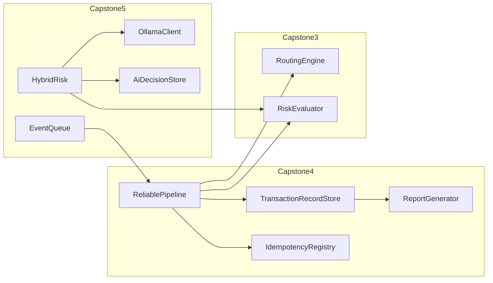

# PayNest

A simplified fintech/ecommerce platform for teaching Java. This project simulates a commerce backend where merchants can create products, accept customer orders, and process payments.

## Project Overview

PayNest is a fictional platform that allows merchants to:

- Create products with names and prices
- Accept customer orders
- Process payments via multiple payment methods (card, EFT, wallet)

The codebase is designed for beginner–intermediate Java students and will be extended through multiple capstones. Later capstones add persistence and optional AI-assisted monitoring; early capstones use plain Java with clear packages.

## Company Background

PayNest is a fictional fintech company providing a simplified commerce backend. The platform enables merchants to manage products, handle customer orders, and accept various payment types. This project represents a teaching simulation of such a system.

## How to Run the Project

### Prerequisites

- Java 21
- Maven 3.6+
- **Capstone 5 only:** [Ollama](https://ollama.com/) installed locally (`ollama serve`), with a small model pulled (for example `ollama pull llama3.2`)

### Build and Run

```bash
# Compile the project
mvn compile

# Run unit tests
mvn test

# Run the application
mvn exec:java
```

Alternatively:

```bash
mvn compile exec:java -Dexec.mainClass="com.paynestsystem.app.PayNestApplication"
```

### Expected Output

```
Order Summary
Customer: John Smith

Items:
Laptop x1 - R12000
Mouse x2 - R400

Total: R12400

Payment successful via CARD
Amount: R12400
Order completed successfully.
```

The default `PayNestApplication` demonstrates **Capstones 1–2** only. Capstones 3–5 are exercised from tests or your own `main` methods.

## Capstone assessments (authoritative briefs)

Learner-facing **project briefs**, **deliverables**, and **rubrics** live under **[`docs/assessments/`](docs/assessments/README.md)**. Use them as the assignment specification; this README stays focused on build, layout, and quick orientation.

| Capstone | Brief |
|----------|--------|
| 1 | [Merchant order desk and catalogue engine](docs/assessments/capstone-01-commerce-engine.md) |
| 2 | [Unified checkout across payment rails](docs/assessments/capstone-02-payment-methods.md) |
| 3 | [Smart rails selection and transaction risk](docs/assessments/capstone-03-routing-risk.md) |
| 4 | [Durable payment attempts and operations-grade reliability](docs/assessments/capstone-04-persistence-reliability.md) |
| 5 | [Near-real-time risk monitoring with local LLM assistance](docs/assessments/capstone-05-agentic-monitoring.md) |

**Grading grids:** [Excel workbook](docs/Capstones%20(2).xlsx) (one sheet per capstone) and [CSV mirrors](docs/capestone-rubrics/README.md) aligned with each brief’s rubric table.

**Live sessions:** [ERD + code-first migrations (2026-07-16)](docs/live-sessions/20260716-ERDMigrations/README.md) — beginner walkthrough from domain classes to H2 DDL (Capstone 4 prep). The draw.io ERD is visualisation only; migrations are written from Java classes.

**Scaffolding note:** Capstones 3–5 ship with interfaces, skeleton implementations, and `TODO`s in code—complete behaviour to the brief, not only the stubs.

### Architecture (capstones 3–5)



## Learning Objectives

Objectives are summarized here; each assessment brief defines outcomes and grading in detail.

- **Capstone 1:** Classes, objects, constructors, encapsulation, collections (`List`), basic business logic
- **Capstone 2:** Interfaces, inheritance, polymorphism, dependency design, basic architecture
- **Capstone 3:** Layered design, strategy-style routing, risk scoring, configuration placeholders, extending interfaces without a finished rules engine
- **Capstone 4:** Persistence, idempotency, lifecycle state, operational reporting, failure handling
- **Capstone 5:** Hybrid risk assessment, external HTTP integration, defensive parsing, queued monitoring, audit trails

## Project Structure

```
src/main/java/com/paynestsystem/
├── domain/           # Product, Customer, OrderItem, Order, Transaction, TransactionStatus,
│                     # TransactionRecord, AiDecisionRecord
├── service/          # OrderService
├── payment/          # PaymentMethod, implementations, PaymentProcessor
├── routing/          # RoutingEngine, DefaultRoutingEngine, RouteDecision, DecisionLogger
├── rules/            # RoutingRule, AbstractRoutingRule, example rules
├── providers/        # PaymentProvider, BasePaymentProvider, ProviderA, ProviderB
├── risk/             # RiskLevel, RiskEvaluator, BasicRiskEvaluator, AiResponseParser, HybridRiskEvaluator
├── config/           # RoutingConfig
├── persistence/      # TransactionRecordStore, IdempotencyRegistry, AiDecisionStore; InMemory* stubs
├── persistence/jdbc/ # H2Schema DDL placeholders
├── reliability/      # ReliableTransactionPipeline, PipelineResult
├── reporting/        # ReportGenerator, OperationsReport, StubReportGenerator
├── ollama/           # OllamaConfig, OllamaClient, HttpOllamaClient, UnavailableOllamaClient
├── monitoring/       # RiskMonitoringService
└── app/              # PayNestApplication (Capstones 1–2 demo)
```
