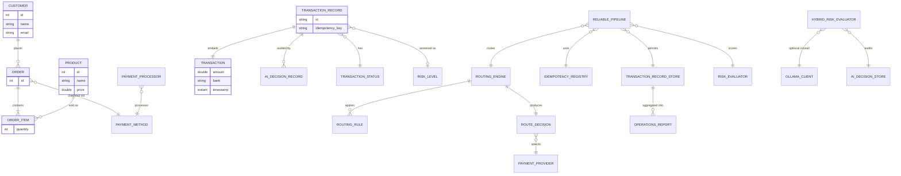
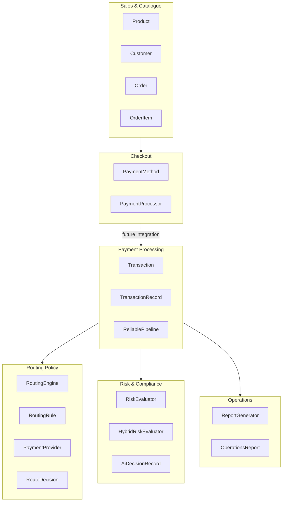
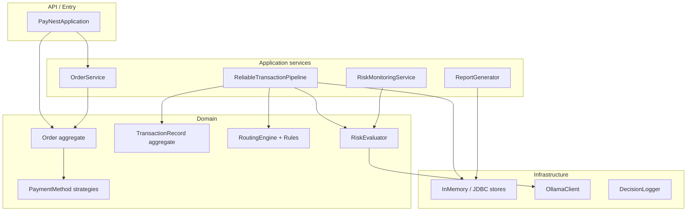
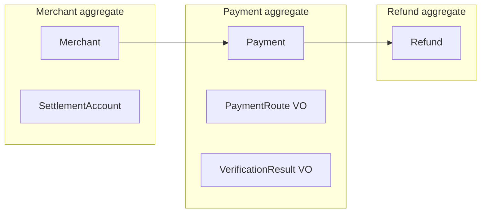

# PayNest Capstone One — Noun–Verb Domain Analysis

> **For students:** Read this like a detective story. Every class name in the repo was once a word someone said in a meeting. Your job is to learn *why* it became code the way it did — and how to do the same on your own project.

---

## 1. High-level business domain

### What problem is PayNest solving?

PayNest is a **fictional South African fintech** building lightweight commerce tools for **small merchants** (hardware sellers, market stalls, online shops) who cannot afford enterprise platforms like Shopify.

The system evolves through five capstones:

| Phase | Pain | Solution |
|-------|------|----------|
| **Capstone 1** | Spreadsheets and WhatsApp; line totals disagree with invoices | A **commerce kernel**: products, customers, orders, trustworthy totals |
| **Capstone 2** | Hard-coded `if card / else EFT` checkout | **One checkout funnel** via polymorphic payment methods |
| **Capstone 3** | Manual processor choice; no audit trail | **Policy-driven routing** + first-pass risk scoring |
| **Capstone 4** | State lost on restart; duplicate webhooks double-post | **Durable records**, idempotency, operational reporting |
| **Capstone 5** | Rule-only fraud misses nuance | **Hybrid rule + AI** monitoring with audit and graceful fallback |

**Capstone One** specifically delivers the **merchant order desk**: catalogue, customer identity, order lines, and a reconcilable grand total — *before* any payment integration.

### Who are the business actors?

| Actor | Role in the system |
|-------|-------------------|
| **Merchant / SME seller** | Creates products, builds orders, demos to customers |
| **Customer / buyer** | Person linked to an order (`Customer`: id, name, email) |
| **Junior backend engineer** (you) | Implements capstones in plain Java |
| **Operations / support** | Replays CLI demos; reads routing and risk logs |
| **Finance** | Needs durable counts, no double-posting (Capstone 4+) |
| **Risk & compliance** | Reviews risk labels and AI audit trails (Capstone 5) |
| **Upstream payment processors** | Provider A, Provider B — external PSPs (Capstone 3+) |
| **Upstream client systems** | Send payment attempts with idempotency keys (Capstone 4+) |

### Main business workflows

#### Workflow A — Order desk (Capstone 1) ✅ implemented

```
Create Products → Create Customer → Create Order
  → addItem(Product, quantity) × N
  → calculateTotal() / printSummary()
```

Entry point: `PayNestApplication`

#### Workflow B — Checkout (Capstone 2) ✅ implemented

```
Build order → calculate grand total
  → select PaymentMethod (Card / EFT / Wallet)
  → PaymentProcessor.processPayment(method, amount)
  → print completion message
```

Triggered by: `Order.checkout(PaymentMethod)`

#### Workflow C — Route & score (Capstone 3) 🚧 skeleton

```
Transaction(amount, bank, timestamp)
  → RoutingEngine (priority-ordered rules)
  → RouteDecision(provider, reason, applied rules, fallback flag)
  → RiskEvaluator → RiskLevel
  → DecisionLogger (audit)
```

#### Workflow D — Durable pipeline (Capstone 4) 🚧 partial

```
process(Transaction, idempotencyKey)
  → IdempotencyRegistry check
  → create TransactionRecord (PENDING)
  → route + evaluate risk
  → persist → status ROUTED / FAILED
  → duplicate key → return stored outcome
```

#### Workflow E — Monitoring (Capstone 5) 🚧 partial

```
enqueue(Transaction) → worker drain loop
  → HybridRiskEvaluator (rules + Ollama)
  → AiDecisionRecord persisted
  → TransactionRecord monitoring fields updated
```

---

## 2. Ubiquitous language — nouns classified

> **DDD tip:** Not every noun becomes a class. Some become enums, interfaces, or packages. The classification below describes *intent*.

### Commerce context (Capstone 1–2)

| Noun | Classification | Code location |
|------|----------------|---------------|
| **Merchant** | Actor (implicit) | Not modeled — persona in docs only |
| **Customer** | Entity | `domain.Customer` |
| **Product** | Entity | `domain.Product` |
| **Order** | **Aggregate root** | `domain.Order` |
| **Order item / line** | Entity (child) | `domain.OrderItem` |
| **Grand total** | Value (computed) | `Order.calculateTotal()` |
| **Order summary** | DTO / read model | `Order.printSummary()` output |
| **Payment rail** | Value Object (concept) | Enum-like labels: CARD, EFT, WALLET |
| **Payment method** | Entity-like strategy | `payment.PaymentMethod` interface |
| **Card payment** | Entity (strategy impl) | `payment.CardPayment` |
| **EFT payment** | Entity (strategy impl) | `payment.EftPayment` |
| **Wallet payment** | Entity (strategy impl) | `payment.WalletPayment` |
| **Payment processor** | **Domain / application service** | `payment.PaymentProcessor` |
| **Order service** | **Application service** | `service.OrderService` |
| **Rand (R)** | Value Object (implicit) | `double` + console formatting |

### Payment processing context (Capstone 3–5)

| Noun | Classification | Code location |
|------|----------------|---------------|
| **Transaction** | **Value Object** | `domain.Transaction` (amount, bank, timestamp) |
| **Transaction record** | **Aggregate root** | `domain.TransactionRecord` |
| **Transaction status** | Value Object (enum) | `domain.TransactionStatus` |
| **Idempotency key** | Value Object | `String` on `TransactionRecord` |
| **Payment provider** | External System (abstraction) | `providers.PaymentProvider` |
| **Provider A / B** | External System (impl) | `providers.ProviderA`, `ProviderB` |
| **Routing engine** | **Domain service** | `routing.RoutingEngine` |
| **Routing rule** | Entity / policy object | `rules.RoutingRule` |
| **Amount routing rule** | Entity (rule impl) | `rules.AmountRoutingRule` |
| **Bank support rule** | Entity (rule impl) | `rules.BankSupportRule` |
| **Fallback rule** | Entity (rule impl) | `rules.FallbackRule` |
| **Route decision** | **Value Object** | `routing.RouteDecision` |
| **Routing config** | Value Object / config DTO | `config.RoutingConfig` |
| **Risk level** | Value Object (enum) | `risk.RiskLevel` |
| **Risk evaluator** | **Domain service** (interface) | `risk.RiskEvaluator` |
| **Basic risk evaluator** | Domain service (impl) | `risk.BasicRiskEvaluator` |
| **Hybrid risk evaluator** | Domain service (impl) | `risk.HybridRiskEvaluator` |
| **AI decision record** | Entity (audit) | `domain.AiDecisionRecord` |
| **AI response parser** | Domain service | `risk.AiResponseParser` |
| **Decision logger** | Infrastructure / audit | `routing.DecisionLogger` |
| **Pipeline result** | DTO | `reliability.PipelineResult` |
| **Operations report** | DTO / read model | `reporting.OperationsReport` |

### Persistence & infrastructure

| Noun | Classification | Code location |
|------|----------------|---------------|
| **Idempotency registry** | **Repository** | `persistence.IdempotencyRegistry` |
| **Transaction record store** | **Repository** | `persistence.TransactionRecordStore` |
| **AI decision store** | **Repository** | `persistence.AiDecisionStore` |
| **Reliable transaction pipeline** | **Application service** | `reliability.ReliableTransactionPipeline` |
| **Report generator** | Application / query service | `reporting.ReportGenerator` |
| **Risk monitoring service** | **Application service** (background) | `monitoring.RiskMonitoringService` |
| **Ollama** | **External System** | `ollama.OllamaClient` |
| **Event queue** | Infrastructure | `BlockingQueue` inside `RiskMonitoringService` |
| **H2 database** | External System | `persistence.jdbc.H2Schema` (DDL placeholder) |

### Events (conceptual — not yet implemented as event classes)

| Noun | Classification | Notes |
|------|----------------|-------|
| **Order placed** | Event (future) | Would fire after checkout success |
| **Payment routed** | Event (future) | Implied when status → `ROUTED` |
| **Payment failed** | Event (future) | Implied when status → `FAILED` |
| **Duplicate request detected** | Event (implicit) | `PipelineResult.duplicateRequest == true` |
| **AI assessment completed** | Event (future) | After `evaluateAndAudit` |

---

## 3. Verbs — grouped by type

### Commands (actions initiated by users or systems)

| Verb | Initiator | Code |
|------|-----------|------|
| **Create order** | Merchant / app | `OrderService.createOrder` |
| **Add item** | Merchant / app | `Order.addItem` |
| **Checkout** | Customer / merchant | `Order.checkout` |
| **Process payment** | Checkout flow | `PaymentProcessor.processPayment` |
| **Process transaction** | Upstream client | `ReliableTransactionPipeline.process` |
| **Bind idempotency key** | Pipeline (system) | `IdempotencyRegistry.bind` |
| **Enqueue for monitoring** | Pipeline / watcher | `RiskMonitoringService.enqueue` |
| **Save record** | Pipeline / stores | `TransactionRecordStore.save` |
| **Route** | Pipeline | `RoutingEngine.route` |
| **Evaluate risk** | Pipeline / monitoring | `RiskEvaluator.evaluate` |
| **Evaluate and audit** | Monitoring worker | `HybridRiskEvaluator.evaluateAndAudit` |

### Domain behaviours (business rules inside aggregates or policies)

| Verb | Where | Meaning |
|------|-------|---------|
| **Calculate total** (line) | `OrderItem.calculateTotal` | unitPrice × quantity |
| **Calculate total** (order) | `Order.calculateTotal` | sum of line totals |
| **Set status** | `TransactionRecord.setStatus` | lifecycle transition + timestamp |
| **Matches** (rule) | `RoutingRule.matches` | does this transaction fit the rule? |
| **Merge rule and AI** | `AiResponseParser.mergeRuleAndAi` | conservative risk merge |
| **Parse risk token** | `AiResponseParser` | extract LOW/MEDIUM/HIGH from LLM output |

### Queries (read without side effects)

| Verb | Code |
|------|------|
| **Get** / accessors | All domain getters |
| **Lookup idempotency key** | `IdempotencyRegistry.lookup` |
| **Find by id** | `TransactionRecordStore.findById` |
| **Find AI decision by record** | `AiDecisionStore.findByTransactionRecordId` |
| **Generate summary** | `ReportGenerator.generateSummary` |
| **Is duplicate request** | `PipelineResult.isDuplicateRequest` |
| **Is provider available** | `PaymentProvider.isAvailable` |

### Events (things that happened — mostly implicit today)

| Verb (past tense) | Signal in code |
|-------------------|----------------|
| **Payment succeeded** | Console: "Payment successful via CARD" |
| **Order completed** | Console: "Order completed successfully." |
| **Transaction routed** | `TransactionStatus.ROUTED` |
| **Transaction failed** | `TransactionStatus.FAILED` |
| **Duplicate detected** | `PipelineResult(…, duplicateRequest=true)` |
| **Fallback used** | `RouteDecision.fallbackUsed == true` |
| **AI fallback used** | `AiDecisionRecord.usedFallback == true` |

### Infrastructure operations

| Verb | Code |
|------|------|
| **Log decision** | `DecisionLogger.log` |
| **Drain queue** | `RiskMonitoringService.drain` |
| **Risk assessment (HTTP)** | `OllamaClient.riskAssessment` |
| **Save to in-memory map** | `InMemory*Store.save` |
| **Apply DDL / migration** | `H2Schema`, `schema-v1.sql` (Capstone 4) |
| **Print summary** | `Order.printSummary` (presentation) |

---

## 4. Domain model — aggregates

### Aggregate 1: Order (commerce)

| Aspect | Detail |
|--------|--------|
| **Root** | `Order` |
| **Child entities** | `OrderItem` (each links one `Product` + quantity) |
| **Referenced entities** | `Customer` (by reference), `Product` (via OrderItem) |
| **Value objects** | Line subtotal (computed), grand total (computed) |
| **Responsibilities** | Collect line items; compute trustworthy total; initiate checkout |
| **Invariants** | Grand total = sum of line subtotals; quantities should be positive; items list should not be corrupted externally |
| **Lifecycle** | Created empty → items added → total calculated → optional checkout → completed (console message) |

**Beginner note:** `Order` is the only object that should *change* the list of items. Callers use `addItem`, not direct list mutation.

### Aggregate 2: TransactionRecord (payment processing)

| Aspect | Detail |
|--------|--------|
| **Root** | `TransactionRecord` |
| **Child value object** | `Transaction` (immutable snapshot: amount, bank, timestamp) |
| **Value objects** | `TransactionStatus`, `RiskLevel`, idempotency key, routing/AI summaries |
| **Related audit entity** | `AiDecisionRecord` (separate aggregate, linked by `transactionRecordId`) |
| **Responsibilities** | Durable identity for a payment attempt; enforce status transitions; hold routing/risk/monitoring enrichment |
| **Invariants** | One idempotency key → one logical outcome; no replay while `PENDING`; status grammar: `PENDING → ROUTED → COMPLETED` or `FAILED` |
| **Lifecycle** | Created `PENDING` → routed + risk assessed → `ROUTED` (target: `COMPLETED` after provider call) or `FAILED` on error |

### Aggregate 3: RouteDecision (decision record — immutable)

| Aspect | Detail |
|--------|--------|
| **Type** | Value Object (not a classic aggregate, but an important domain artifact) |
| **Fields** | selected provider, human reason, applied rule IDs, fallback flag |
| **Responsibilities** | Capture *why* a provider was chosen — auditability |
| **Invariants** | Immutable after creation; `fallbackUsed` must be honest |

### Supporting entities (not aggregate roots)

| Entity | Owned by | Notes |
|--------|----------|-------|
| `Customer` | Referenced by Order | Identity only in Capstone 1 |
| `Product` | Referenced by OrderItem | Catalogue item |
| `AiDecisionRecord` | Linked to TransactionRecord | Append-only audit |

---

## 5. Relationship diagram (Mermaid)



### Context map (bounded contexts)



---

## 6. Bounded contexts — why the repo is split this way

PayNest is **one Maven project** but **several bounded contexts** that grow with each capstone. They are split because the **ubiquitous language changes** and **consistency boundaries** differ.

| Bounded context | Package roots | Why separate? |
|-----------------|---------------|---------------|
| **Catalogue & ordering** | `domain` (Order, Product, Customer), `service` | Merchant-facing; in-memory; no payment processors |
| **Checkout & payment rails** | `payment` | Customer-facing; strategy pattern; different lifecycle than routing |
| **Payment processing** | `domain.Transaction*`, `reliability` | Upstream integration; idempotency; durable state |
| **Routing policy** | `routing`, `rules`, `providers`, `config` | Pluggable rules; explainable decisions; changes often |
| **Risk assessment** | `risk`, `monitoring`, `ollama` | Different experts (fraud vs payments); AI is optional |
| **Persistence** | `persistence`, `persistence.jdbc` | Technical concern isolated behind repositories |
| **Reporting** | `reporting` | Read-only aggregates; different access patterns |

### Why two "payment" models?

| Concept | Context | Class |
|---------|---------|-------|
| How the **customer pays the merchant** | Checkout | `PaymentMethod` (Card, EFT, Wallet) |
| Which **upstream processor** handles a transaction | Payment processing | `PaymentProvider` (Provider A, B) |

These are **different bounded contexts**. A card checkout at the merchant shop is not the same conversation as routing R50,000 to Provider B because of bank support rules. The codebase keeps them separate on purpose (even though Capstone 1–2 demo does not yet link them).

### Anti-pattern the split avoids

One giant `PaymentService` that knows about laptops, idempotency keys, Ollama, and FNB routing rules. That becomes a **god class** — hard to test, hard to change, hard to explain in a stand-up.

---

## 7. Use cases

### UC1 — Maintain product catalogue

| | |
|---|---|
| **Trigger** | Merchant adds inventory |
| **Actor** | Merchant |
| **Steps** | 1. Create `Product` with id, name, price 2. Store for use in orders |
| **Outcome** | Product available for `Order.addItem` |

### UC2 — Register customer

| | |
|---|---|
| **Trigger** | New buyer at order desk |
| **Actor** | Merchant |
| **Steps** | 1. Create `Customer` with id, name, email |
| **Outcome** | Customer can be linked to an order |

### UC3 — Build order with line items

| | |
|---|---|
| **Trigger** | Customer selects products |
| **Actor** | Merchant |
| **Steps** | 1. `OrderService.createOrder` 2. `addItem(product, qty)` for each line |
| **Outcome** | Order with one or more `OrderItem`s |

### UC4 — Calculate and display order total

| | |
|---|---|
| **Trigger** | Merchant requests receipt / demo |
| **Actor** | Merchant, reviewer |
| **Steps** | 1. `calculateTotal` 2. `printSummary` |
| **Outcome** | Human-readable summary; totals manually reconcilable |

### UC5 — Checkout with payment method

| | |
|---|---|
| **Trigger** | Customer ready to pay |
| **Actor** | Customer (via merchant) |
| **Steps** | 1. `calculateTotal` 2. Select `PaymentMethod` 3. `checkout(method)` 4. `PaymentProcessor.processPayment` |
| **Outcome** | Payment message printed; order marked complete in console |

### UC6 — Route transaction to provider

| | |
|---|---|
| **Trigger** | Upstream payment attempt received |
| **Actor** | System (pipeline) |
| **Steps** | 1. Build `Transaction` 2. `RoutingEngine.route` 3. Evaluate rules by priority 4. Produce `RouteDecision` 5. `DecisionLogger.log` |
| **Outcome** | Provider selected with documented reason |

### UC7 — Assess transaction risk

| | |
|---|---|
| **Trigger** | Transaction routed or enqueued |
| **Actor** | System |
| **Steps** | 1. `RiskEvaluator.evaluate` 2. Apply amount/velocity heuristics 3. Return `RiskLevel` |
| **Outcome** | Risk label stored on record |

### UC8 — Process payment attempt idempotently

| | |
|---|---|
| **Trigger** | Client POST with idempotency key (possibly retry) |
| **Actor** | Upstream client system |
| **Steps** | 1. `lookup` key 2. If exists and complete → return duplicate 3. If new → create `PENDING` record 4. Route + risk 5. Update status 6. Return `PipelineResult` |
| **Outcome** | Exactly-once business effect per key |

### UC9 — Fail closed on incomplete idempotency binding

| | |
|---|---|
| **Trigger** | Retry while prior attempt still `PENDING` or record missing |
| **Actor** | System |
| **Steps** | 1. `lookup` finds key 2. Record missing or `PENDING` 3. Throw `IllegalStateException` |
| **Outcome** | Caller must retry later; no silent corruption |

### UC10 — Hybrid AI risk assessment

| | |
|---|---|
| **Trigger** | Monitoring worker dequeues transaction |
| **Actor** | Risk monitoring service |
| **Steps** | 1. Rule-based score 2. Optional Ollama call 3. `mergeRuleAndAi` 4. Save `AiDecisionRecord` 5. Update record monitoring fields |
| **Outcome** | Conservative risk level; audit trail even when AI offline |

### UC11 — Generate operations report

| | |
|---|---|
| **Trigger** | End of day / ops dashboard |
| **Actor** | Finance, operations |
| **Steps** | 1. `ReportGenerator.generateSummary` 2. Aggregate from `TransactionRecordStore` |
| **Outcome** | `OperationsReport` with counts and Rand volume |

---

## 8. Architecture mapped to business language

| Component | Business phrase | Layer | Why it exists |
|-----------|-----------------|-------|---------------|
| `Product`, `Customer`, `Order`, `OrderItem` | "What we sell, who buys, what's in the basket" | **Domain** | Core commerce truth |
| `Transaction`, `TransactionRecord` | "A payment attempt we must not lose" | **Domain** | Payment processing truth |
| `OrderService` | "Help me start and fill an order" | **Application** | Thin orchestration; no business rules of its own |
| `PaymentProcessor` | "Charge this amount using that rail" | **Domain / Application** | Coordinates payment strategy (debate: could be application service) |
| `PaymentMethod` implementations | "Card / EFT / Wallet behave differently" | **Domain** | Polymorphic domain behaviour |
| `ReliableTransactionPipeline` | "Handle this payment attempt safely once" | **Application** | Orchestrates domain + infrastructure; not a business noun itself |
| `RoutingEngine`, `RoutingRule` | "Pick the right processor for this transaction" | **Domain** | Core policy |
| `RiskEvaluator`, `HybridRiskEvaluator` | "How risky is this transaction?" | **Domain** | Core policy |
| `RouteDecision`, `PipelineResult`, `OperationsReport` | "What happened?" (read models) | **Domain / Application DTO** | Carry outcomes across layers |
| `IdempotencyRegistry`, `*Store` | "Remember keys and records" | **Infrastructure** (repository interfaces in domain-facing packages) | Persistence abstraction |
| `InMemory*Store`, `H2Schema` | "Where bits live on disk" | **Infrastructure** | Technical detail |
| `OllamaClient`, `HttpOllamaClient` | "Ask the local LLM" | **Infrastructure** | External system adapter |
| `DecisionLogger` | "Write routing audit to console" | **Infrastructure** | Cross-cutting audit |
| `RiskMonitoringService` | "Watch transactions in the background" | **Application** | Process manager / worker |
| `PayNestApplication` | "Run the demo" | **API / entry point** | CLI composition root |
| `RoutingConfig`, `OllamaConfig` | "Thresholds and URLs" | **Infrastructure / config** | Environment-specific values |

### Layer diagram



---

## 9. Nouns → design choices (with examples)

### Became an **Entity** (identity matters)

| Noun | Class | Why not a value object? |
|------|-------|-------------------------|
| Customer | `Customer` | Stable id; same person across orders |
| Product | `Product` | Catalogue item tracked by id |
| Order item | `OrderItem` | Distinct line on an order (product + qty) |
| AI decision | `AiDecisionRecord` | Separate audit row with timestamp |

### Became a **Value Object** (defined by attributes, immutable)

| Noun | Class | Why? |
|------|-------|------|
| Transaction (routing input) | `Transaction` | Snapshot of amount/bank/time; no own lifecycle |
| Route decision | `RouteDecision` | Immutable fact: who, why, which rules |
| Risk level | `RiskLevel` enum | Fixed vocabulary |
| Pipeline result | `PipelineResult` | Outcome bundle, no identity |

### Became an **Aggregate root**

| Noun | Class | Why? |
|------|-------|------|
| Order | `Order` | Controls items; total must stay consistent |
| Transaction record | `TransactionRecord` | Idempotency + status envelope around transaction |

### Became a **Service** (verb-heavy or spans objects)

| Noun | Class | Why? |
|------|-------|------|
| Routing | `RoutingEngine` | No single "routing" entity; it's a process over rules + providers |
| Risk evaluation | `RiskEvaluator` | Policy over a `Transaction`, not a stored "risk thing" |
| Order desk helper | `OrderService` | Application workflow, not a business object |
| Payment processing | `ReliableTransactionPipeline` | Coordinates many parts |

---

## 10. Verbs → design choices (with examples)

### Became a **method**

| Verb | Method | Owner |
|------|--------|-------|
| Add item | `addItem` | `Order` |
| Calculate total | `calculateTotal` | `Order`, `OrderItem` |
| Checkout | `checkout` | `Order` |
| Match rule | `matches` | `RoutingRule` |
| Set status | `setStatus` | `TransactionRecord` |

### Became a **command** (application entry)

| Verb | Command | Notes |
|------|---------|-------|
| Process transaction | `ReliableTransactionPipeline.process` | Single front door for payment attempts |
| Create order | `OrderService.createOrder` | Factory-style command |
| Enqueue | `RiskMonitoringService.enqueue` | Async intake |

### Became a **domain event** (target state — mostly implicit today)

| Verb | Today | Better future |
|------|-------|---------------|
| Payment routed | `setStatus(ROUTED)` | `TransactionRouted` event |
| Payment failed | `setStatus(FAILED)` | `TransactionFailed` event |
| Duplicate detected | `duplicateRequest` flag | `DuplicatePaymentAttemptDetected` event |

### Became a **background process**

| Verb | Implementation |
|------|----------------|
| Monitor risk | `RiskMonitoringService` worker loop + `drain` |
| (Future) Retry failed | Would be scheduled job reading `FAILED` records |

---

## 11. Why these decisions — not simpler alternatives?

| Decision | Simpler alternative | Why PayNest chose differently |
|----------|---------------------|------------------------------|
| `PaymentMethod` interface | `if (type == "CARD")` | Capstone 2: new rails without touching checkout |
| Separate `PaymentProvider` | Reuse `PaymentMethod` | Different context — upstream PSP vs customer rail |
| `Transaction` as value object | Mutable transaction entity | Routing input is a snapshot; record owns lifecycle |
| `TransactionRecord` aggregate | Store status on `Transaction` | Idempotency, audit fields, and status transitions need one envelope |
| `RoutingRule` objects | One big `route()` method | Rules change independently; priority ordering; testable units |
| `RouteDecision` value object | Return provider only | Compliance needs *why* and fallback honesty |
| Repository interfaces | JDBC in pipeline | Capstone 4: swap in-memory → H2 without rewriting orchestration |
| `ReliableTransactionPipeline` | Logic in `main` | One place for idempotency + route + risk + persist |
| `HybridRiskEvaluator` | AI only | Graceful degradation; rules stay authoritative |
| `AiDecisionRecord` separate table | Extra columns only | Append-only audit; multiple assessments over time |
| Fail-closed on `PENDING` key | Return partial record | Prevents double-post under concurrent retries |
| Plain Java packages, no Spring | Framework magic | Teaching: see the boundaries explicitly |

### Known teaching trade-offs (intentional)

- `Order.checkout` instantiates `PaymentProcessor` directly — **leak** acceptable at Capstone 2; students later learn dependency injection.
- `TransactionRecord` imports `RiskLevel` from `risk` package — domain purity vs pragmatism for a small project.
- Capstone 1 commerce stays **in-memory** while Capstone 4 payment path gets **durability** — contexts evolve at different speeds.

---

## 12. Apply to your payment orchestration platform (InstaPay-style)

Imagine you are building a platform that routes payments between merchants, banks, and providers — similar to InstaPay.

### Recommended classification

| Your noun | Classification | Rationale |
|-----------|----------------|-----------|
| **Merchant** | **Entity** (own aggregate or ref) | Stable business identity; KYC, settlement account |
| **Customer** | **Entity** | Payer identity; may span merchants |
| **Payment** | **Aggregate root** | Core lifecycle: initiated → routed → verified → settled / failed |
| **Bank** | **External System** (+ value attrs) | You don't own FNB's core banking |
| **Provider** | **External System** (interface) | PSP / switch — like `PaymentProvider` |
| **Payment route** | **Value Object** | Immutable decision: chosen path, reason, rules applied |
| **Verification** | **Domain service** or child VO | OTP, account validation — process, not always stored |
| **Settlement** | **Separate aggregate** or sub-entity | Different lifecycle and timing than authorization |
| **Refund** | **Aggregate root** (or child of Payment) | Own idempotency and status; links to original payment |
| **Notification** | **Infrastructure** + events | Email/SMS/webhook — side effect, not core domain |
| **Amount + currency** | **Value Object** | `Money` type — never raw `double` in production |
| **Idempotency key** | **Value Object** | On Payment aggregate |
| **Route rule** | **Entity / policy** | Like `RoutingRule` |

### Commands (application entry points)

| Command | Maps from PayNest |
|---------|-------------------|
| `InitiatePayment` | `ReliableTransactionPipeline.process` |
| `RoutePayment` | `RoutingEngine.route` |
| `VerifyPayment` | (new) verification service |
| `SettlePayment` | (new) settlement batch command |
| `RequestRefund` | New command with own idempotency key |
| `RegisterMerchant` | `OrderService.createOrder` (factory pattern) |

### Domain events (recommended — PayNest implies but doesn't implement)

| Event | When |
|-------|------|
| `PaymentInitiated` | Record created `PENDING` |
| `PaymentRouted` | Route decision made |
| `PaymentVerified` | OTP / account check passed |
| `PaymentCompleted` | Provider confirmed |
| `PaymentFailed` | Terminal failure |
| `SettlementScheduled` | End-of-day batch |
| `RefundIssued` | Refund aggregate completed |
| `NotificationDispatched` | After state change (infra listener) |

### Suggested aggregates for your platform



---

## Side-by-side comparison

| PayNest (Capstone One) | Your orchestration platform |
|------------------------|----------------------------|
| Merchant (implicit actor) | **Merchant** (entity / aggregate) |
| Customer | **Customer** (entity) |
| Product | **Payment product / rail config** (entity) |
| Order | **Payment intent** or **Payment** (aggregate) |
| OrderItem | **Payment line / fee component** (child entity) |
| Grand total | **Payment amount** (`Money` VO) |
| PaymentMethod (Card/EFT/Wallet) | **Payment instrument** (strategy) |
| PaymentProcessor | **Payment execution service** (application) |
| Transaction | **Payment request snapshot** (VO) |
| TransactionRecord | **Payment** (aggregate root) |
| TransactionStatus | **PaymentStatus** (enum VO) |
| Idempotency key | **Idempotency key** (VO on Payment) |
| PaymentProvider | **Provider** (external system interface) |
| RoutingEngine | **Routing service** (domain) |
| RoutingRule | **Route rule** (policy entity) |
| RouteDecision | **PaymentRoute** (VO) |
| RiskEvaluator | **Fraud / risk service** (domain) |
| RiskLevel | **RiskRating** (enum VO) |
| AiDecisionRecord | **FraudAssessmentRecord** (audit entity) |
| ReliableTransactionPipeline | **Payment orchestration pipeline** (application) |
| IdempotencyRegistry | **Idempotency repository** (infrastructure) |
| TransactionRecordStore | **Payment repository** (infrastructure) |
| ReportGenerator | **Settlement / ops reporting** (application query) |
| RiskMonitoringService | **Async fraud monitoring worker** (application) |
| OllamaClient | **ML / rules engine adapter** (infrastructure) |
| OrderService | **Merchant onboarding / order desk service** (application) |
| DecisionLogger | **Audit / observability adapter** (infrastructure) |

---

## Recommendations — copy vs avoid

### ✅ Copy from PayNest

| Pattern | Why |
|---------|-----|
| **Package per bounded context** | Keeps checkout separate from routing separate from risk |
| **Aggregate roots with clear invariants** | `Order` owns items; `TransactionRecord` owns status |
| **Strategy / interface for variation** | `PaymentMethod`, `RoutingRule`, `RiskEvaluator` |
| **Immutable decision records** | `RouteDecision` — always explain *why* |
| **Repository interfaces** | Swap in-memory → Postgres without rewriting pipeline |
| **Application pipeline for cross-cutting flow** | Idempotency + route + risk + persist in one place |
| **Idempotency as first-class** | Business key on aggregate; fail-closed on incomplete |
| **Conservative merge for AI** | Rules authoritative; AI hints only |
| **Separate audit entities** | `AiDecisionRecord` for compliance |
| **Code-first schema** | Java domain → hand-written DDL (see ERD live session) |
| **CLI demo + JUnit** | Prove behaviour before frameworks |

### ⚠️ Adapt for production

| PayNest teaching choice | Production upgrade |
|---------------------------|-------------------|
| `double` for money | `BigDecimal` or `Money` value object |
| `int` ids | UUID / snowflake |
| In-memory stores | Real DB + transactions |
| Console logging | Structured logs + trace ids |
| No domain events | Event bus for notifications and settlements |
| `Order` creates `PaymentProcessor` | Dependency injection / composition root |

### ❌ Avoid copying blindly

| Anti-pattern in skeleton | Do instead |
|--------------------------|------------|
| God `PaymentService` | Keep contexts separate |
| One model for customer rail + upstream provider | Two bounded contexts |
| Mutable `Transaction` with status | VO snapshot + `Payment` aggregate |
| Silent "first provider in list" routing | Priority rules + explicit fallback flag |
| AI inventing HIGH from noise | Conservative merge + `usedFallback` audit |
| Hard-coded report numbers | Aggregate from persisted rows only |
| Unbounded monitoring queue | Back-pressure + dead-letter policy |
| ERD as migration source | Code-first DDL (PayNest live session) |

---

## Beginner walkthrough — 60-minute live session script

### Part 1 — Talk like the business (10 min)

1. Read the Capstone 1 scenario aloud: spreadsheets, wrong totals, angry merchants.
2. Write nouns on the board as students call them out: **product, customer, order, line, total, payment**.
3. Ask: *"Which of these need an ID that stays the same over time?"* → Customer, Product, Order.
4. Ask: *"Which are just calculated?"* → line subtotal, grand total.

### Part 2 — Map nouns to Capstone 1 code (15 min)

1. Open `domain/Product.java`, `Customer.java`, `Order.java`, `OrderItem.java`.
2. Trace `PayNestApplication`: products → customer → order → `addItem` → `printSummary`.
3. Run `mvn exec:java` — connect console output to `printSummary`.
4. **Exercise:** Students name the aggregate root and explain why `OrderItem` is not the root.

### Part 3 — Verbs and methods (10 min)

1. List verbs: **add, calculate, print, checkout, process**.
2. Match each to a method. Notice `calculateTotal` lives on both `OrderItem` and `Order` — different scopes.
3. Preview Capstone 2: `checkout` is a **command** that delegates to `PaymentProcessor`.

### Part 4 — Peek at Capstone 3–5 without fear (15 min)

1. Show `Transaction` vs `Transaction` in conversation — same word, different context (routing input vs order).
2. Open `ReliableTransactionPipeline.process` — walk the idempotency story using the duplicate-key test as narrative.
3. Show `RouteDecision` fields — *"support will ask why Provider B"* — that's the reason field.
4. Mention `HybridRiskEvaluator` — rules first, AI second.

### Part 5 — Design your own platform (10 min)

1. In pairs, classify: Merchant, Payment, Bank, Refund — entity, VO, aggregate, or service?
2. Compare answers to Section 12 table.
3. Homework: draw a context map with at least three boxes and one dashed "future integration" line.

### Facilitator checklist

- [ ] Demo runs green (`mvn test`, `mvn exec:java`)
- [ ] Students can define **ubiquitous language** in one sentence
- [ ] Students can point to the **Order** aggregate and state one invariant
- [ ] Students know the difference between `PaymentMethod` and `PaymentProvider`
- [ ] Students have seen where idempotency lives (`TransactionRecord` + registry)

---

## Glossary (quick reference)

| Term | One-line definition |
|------|---------------------|
| **Ubiquitous language** | Shared vocabulary between developers and business |
| **Entity** | Thing with identity that persists over time |
| **Value object** | Defined by its attributes; interchangeable if values match |
| **Aggregate** | Cluster of objects with one root enforcing rules |
| **Bounded context** | A boundary where a term has one specific meaning |
| **Repository** | Persistence abstraction — "load/save aggregates" |
| **Domain service** | Operation that doesn't belong on one entity |
| **Application service** | Orchestrates a use case; thin coordination |
| **Command** | "Do something" — changes state |
| **Query** | "Tell me something" — no state change |

---

*Document version: 2026-07-16. Aligned with PayNest capstones 1–5 and live session [ERD + migrations](../20260716-ERDMigrations/README.md).*
